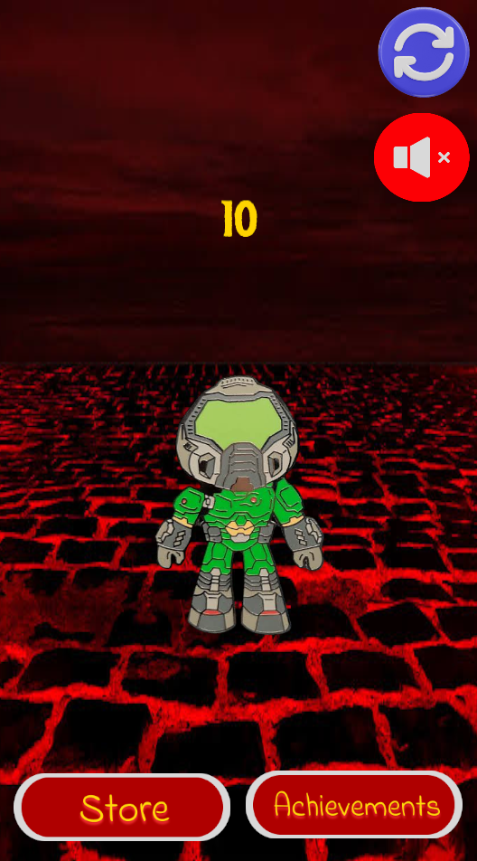
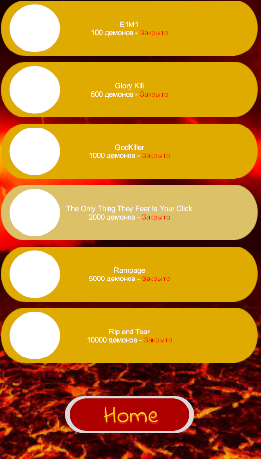
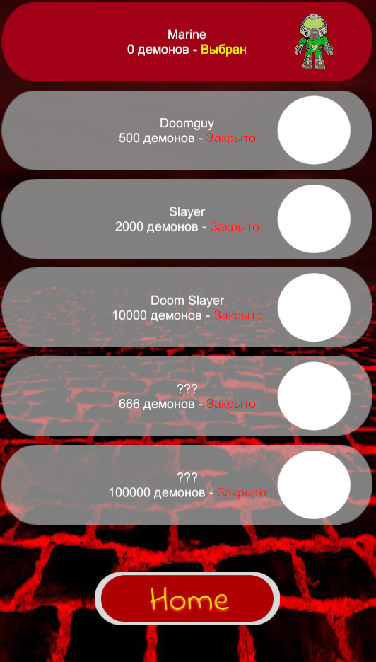

#  Rip and Click

## 📝 Описание
Кликер на Unity, представляющий собой интерактивную игру в жанре clicker/idle. Игрок кликает по думгаю (кнопке) и прибавляет счетчик убийств демонов. Проект разработан с разделением логики на игровую механику (C#/Unity) и интерфейс (UI/Canvas) с использованием системы меню, магазина, выбора персонажа и ачивок.

## 💻 функционал и особенности

* **Игровой цикл:** Реализована основная механика клика - игрок тапает по думгаю, счётчик убитых демонов увеличивается, каждый клик = одно убийство пока не доходит до остальных уровней.
* **Счетчик убийств:** Отображается в реальном времени по центру экрана. Число растёт каждым кликом и служит основным прогрессом. 
* **Магазин (Store):** Внутриигровой магазин с выбором разных скинов Думгая за накопленные убийства.
* **Меню ачивок (Achievements):** Отдельная панель достижений с отслеживанием прогресса. Ачивки выдаются за количество убийств.
* **Аудио-сопровождение:** Фоновая музыка и звуковые эффекты - звуки убийства демонов, достижения ачивки, реализовано через AudioSource.
* **Кнопки управления:** Кнопка перезапуска (reset) и переключатель звука (mute/unmute) в правом верхнем углу экрана.
* **Многоэкранный UI:** Навигация между экранами «Главная (игра)», «Магазин», «Ачивки». Реализована через Canvas и переключение панелей.
* **Компонентная верстка (Unity UI):** Интерфейс собран из переиспользуемых префабов (кнопки).
* **Изоляция конфигурации:** Все временные файлы Unity (Library/, Temp/, Logs/, UserSettings/), системный мусор (.DS_Store) и конфигурационные файлы надёжно скрыты через .gitignore благодаря шаблону из гитхаба.

## 🧑🏻‍💻 Технологии

### Основной стек
- **Unity Engine** - среда разработки для реализации игровой логики, сцен и сборки проекта
- **C#** - базовый язык разработки, вся механика кликера, магазина, ачивок и UI написана на нём

### Интерфейс и верстка
* **Unity UI (Canvas)** - система интерфейса для кнопок, панелей, счётчика и меню
* **Prefabs** - переиспользуемые объекты интерфейса и игровых элементов
* **ScrollView** - компонент Unity UI для прокрутки списка. Позволяет разместить больше элементов, чем помещается на экране, и листать их вверх-вниз.

### Звук и данные
* **AudioSource / AudioListener** - фоновая музыка и звуки демонов (SFX)
* **PlayerPrefs** - сохранение прогресса (количество убийств, покупки, ачивки)

### Инструменты
* **Git + .gitignore** - контроль версий с изоляцией временных файлов Unity
* **Visual Studio** - среда разработки C#-скриптов

## ⏬ Установка

### Требования

* Unity Hub - скачать здесь
* Unity Editor версии (Unity 2022.3 LTS)
* Git - для клонирования репозитория

### Шаги

1. Клонируйте репозиторий:

    ```bash
    git clone https://github.com/skrizzz-dev/rip_and_click.git
    ```

2. Откройте Unity Hub -> нажмите Add -> Add project from disk -> выберите папку Rip_and_Click
   
3. Установите нужную версию Unity
- Unity Hub предложит установить версию, указанную в проекте.
- Согласитесь - Hub скачает и установит её автоматически.

4. Откройте проект - двойной клик по нему в Unity Hub.

5. Запустите игру:
- В Unity откройте сцену из папки Assets/Scenes/SampleScene.
- Нажмите Play вверху редактора

### Сборка

- В Unity: File -> Build Settings -> выберите платформу (Windows/Mac/Linux/Android) -> Build
- Готовый .exe появится в папке Build/


## 📂 Структура проекта

- `Assets/` - все игровые ресурсы: скрипты, сцены, спрайты, звуки, префабы.
  - `Scripts/` - C#-скрипты (кликер, магазин, ачивки, звук)
  - `Scenes/` - сцены Unity
  - `Sprites/` - спрайты Думгая, демонов, фона, иконок.
  - `Audio/` - фоновая музыка и звуки демонов (SFX).
  - `Prefabs/` - переиспользуемые объекты UI и игровых элементов.
- `Packages/` - список зависимостей Unity.
- `ProjectSettings/` - настройки проекта (Input, Physics, Tags, Build Settings).
- `.gitignore` - файл исключений для Git (скрывает venv, кэш и конфиги).
- `README.md` - описание проекта, управление, технологии.


## 📷 Скриншоты

<div style="display: flex; gap: 16px;">
    
    
    
</div>
